# The Trip Handler

[](https://github.com/taylordrew4u2/the-trip-handler/actions/workflows/ci.yml)
[](https://www.typescriptlang.org/)
[](https://nextjs.org/)
[](https://the-trip-handler.vercel.app)

**The Trip Handler** is a full-stack trip coordination app for multi-day group trips. Instead of juggling group chats, spreadsheets, and Venmo requests, one person creates a trip, shares a private invite link, approves who comes, and the entire group gets a single dashboard to handle lodging, meals, beds, the itinerary, contributions, expenses, and Stripe-collected payments.

**Live demo → [the-trip-handler.vercel.app](https://the-trip-handler.vercel.app)**

---

## Screenshots

Captured from the running app against the seeded demo trip by
[`scripts/screenshots.ts`](scripts/screenshots.ts) — `npm run screenshots`. They
are real renders rather than mockups, and regenerating them after a UI change
puts the difference in the diff.

| Member dashboard | Meal poll, mid-vote |
|---|---|
| 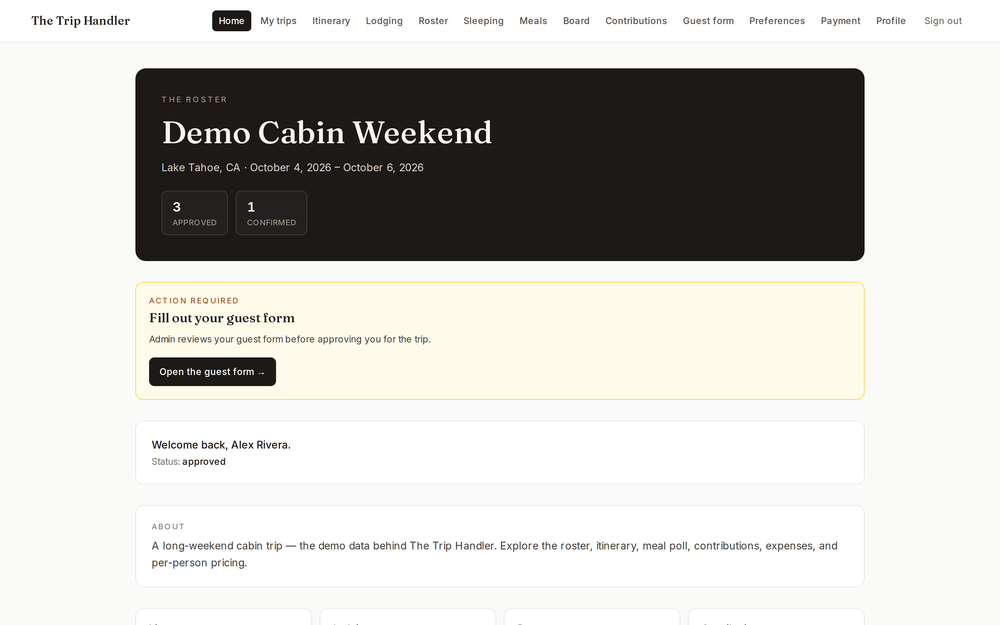 | 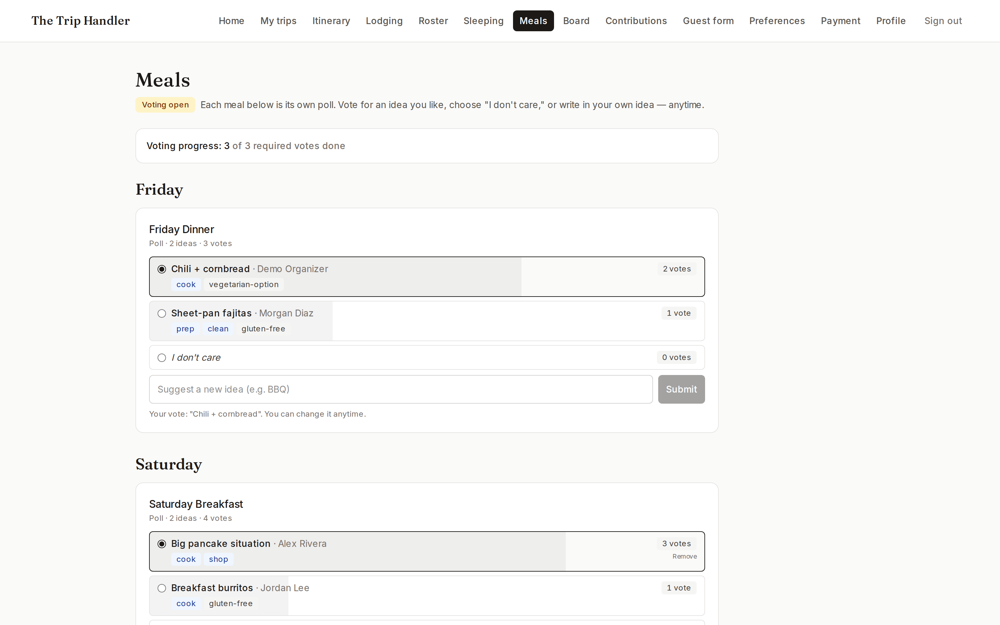 |

| Sleeping arrangements | Group board |
|---|---|
| 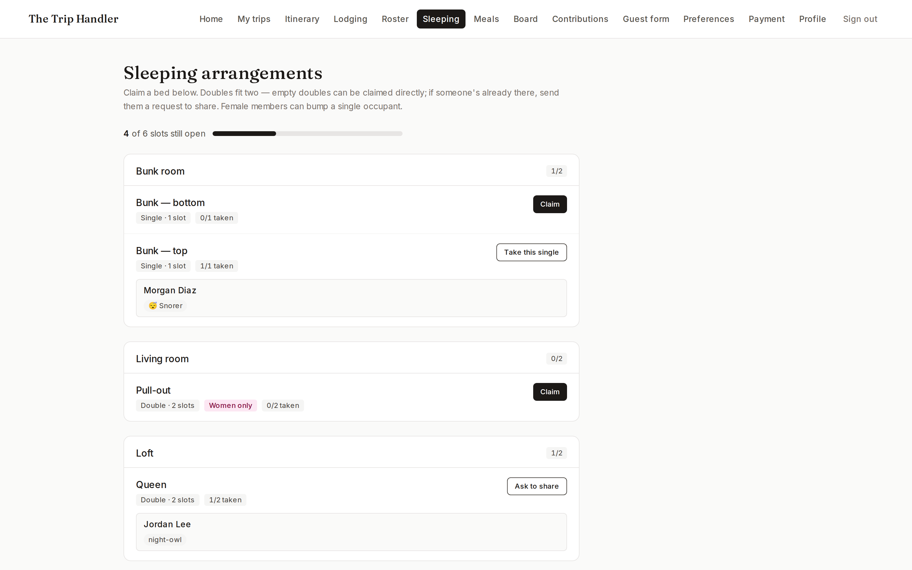 | 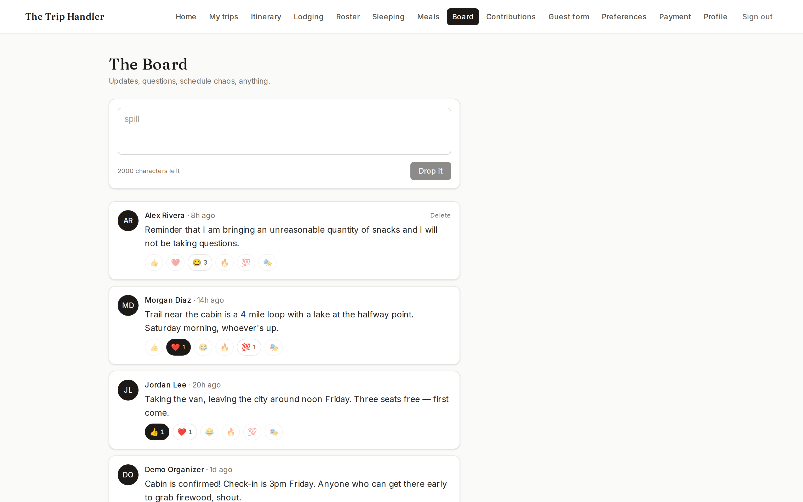 |

| Itinerary | Owner trip management |
|---|---|
| 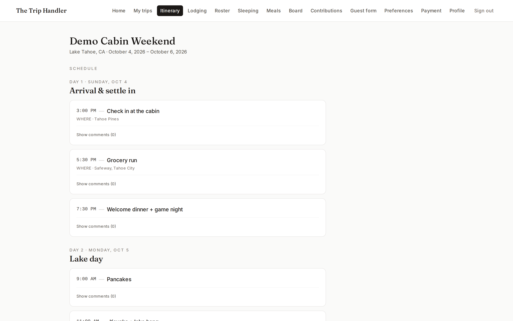 | 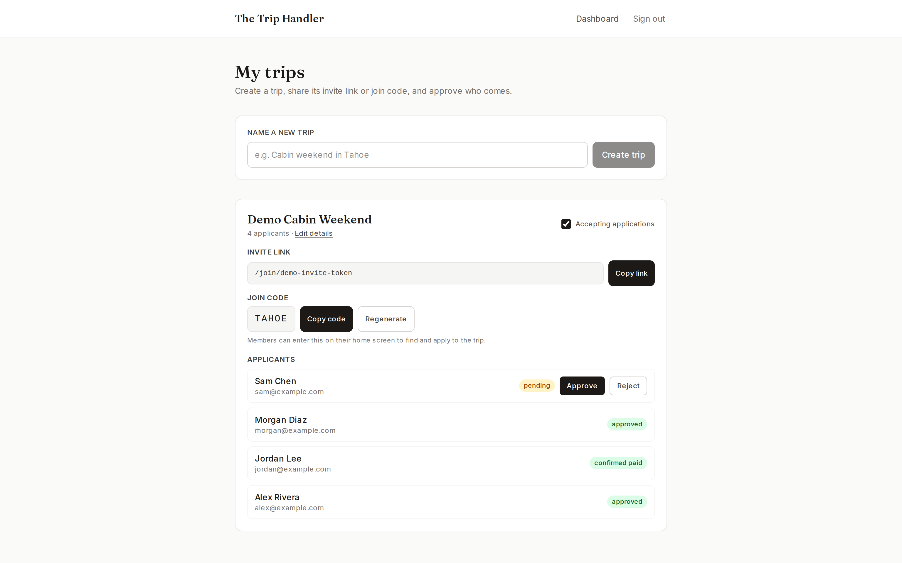 |

### The same app on a phone

Not a shrunk desktop layout — the navigation collapses from thirteen inline tabs
into a grouped sheet, and every control is sized for a thumb.

| Dashboard | Sleeping | Navigation sheet |
|---|---|---|
| 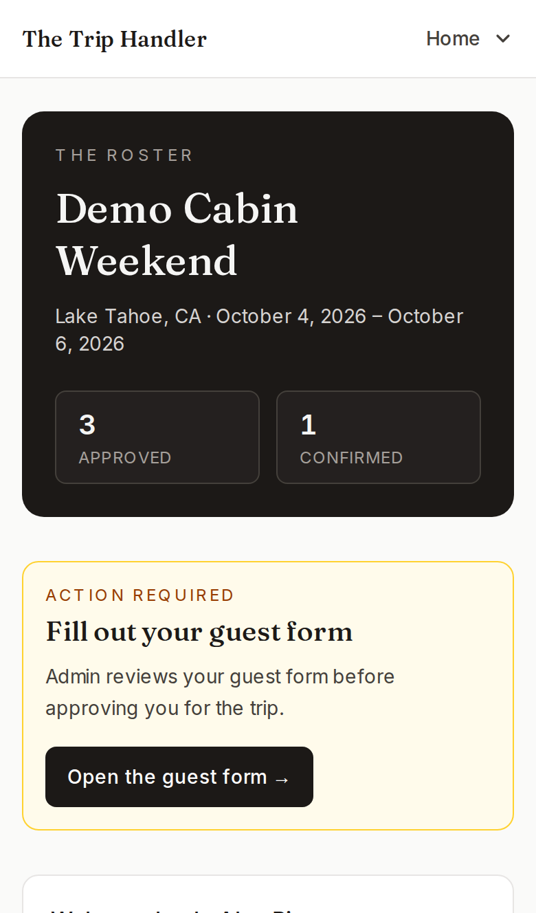 | 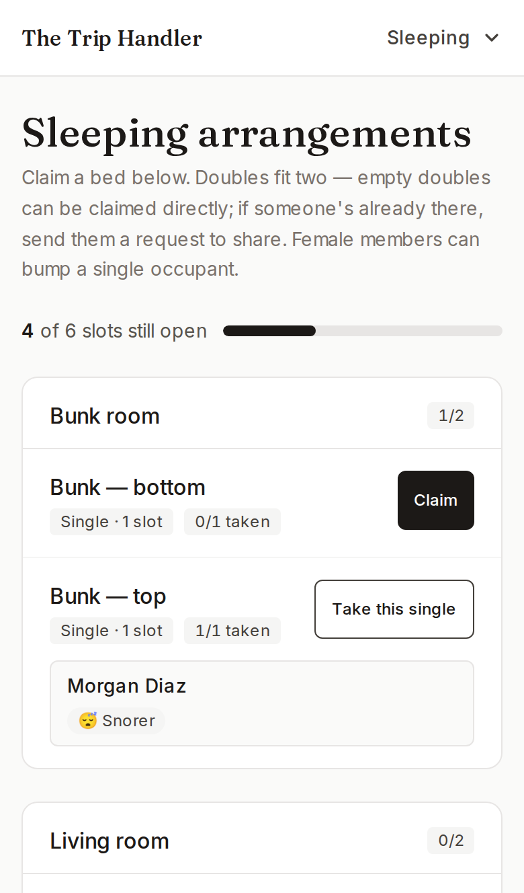 | 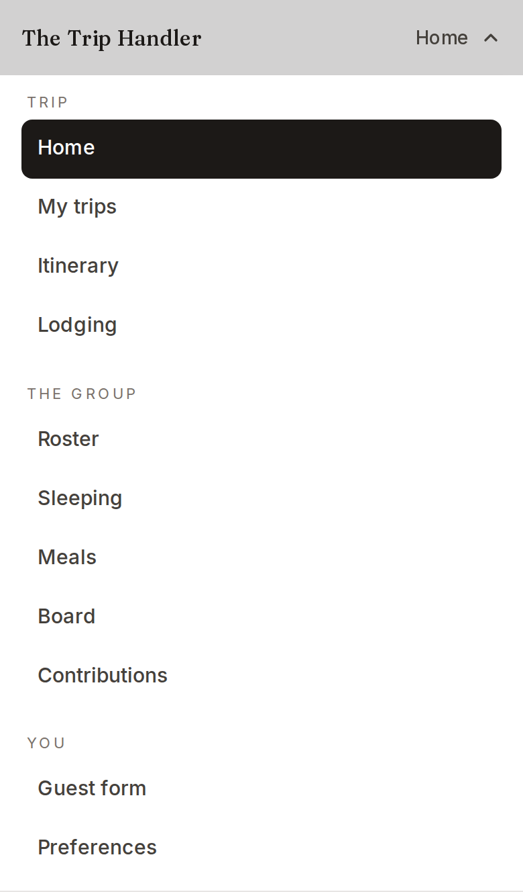 |

---

## What it does

The Trip Handler is invite-only by design. There is no public trip directory — you only get in with a private link or a short join code from the organizer.

**As a trip owner:**
- Create a trip and get a private invite link + shareable join code instantly
- Open and close applications on your schedule
- Review applicants alongside their submitted guest forms, then approve or reject
- Edit trip details, lodging info, itinerary, and meal slots
- Lock the three-line pricing (housing, transport, meals) when numbers are final

**As an invited member:**
- Apply through the invite link; fill out a detailed guest form covering transportation, sleeping preferences, dietary needs, and more
- Once approved, claim a bed, vote on meals, sign up for contributions, comment on the itinerary, submit expenses, and post to the group board
- Pay your per-person share through Stripe Checkout; the app tracks your confirmed-paid status automatically

**Access is gated by status.** A `PENDING` member can read the itinerary and lodging but cannot comment, vote, or claim beds. An `APPROVED` member unlocks the full dashboard. `CONFIRMED_PAID` is the terminal state after Stripe confirms payment.

---

## Features

### Trip creation and invitations
Any signed-in member can create a trip and becomes its owner. The app generates a unique private invite link (`/join/[token]`) and a short verbal join code. Owners can open and close applications at any time, and only ever see and manage trips they created.

### Application and approval flow
Applicants open the invite link (signing up if needed) and fill out a detailed guest form with intake questions covering emergency contacts, van transportation preferences, sleeping tags, dietary restrictions, medical notes, activity interests, and content-creation comfort. The owner reviews submitted forms and approves or rejects applicants. Resend sends a transactional email on each status change.

### Bed assignment and bedmate requests
Owners configure a bed inventory with room names, bed types, and optional restrictions (e.g., women-only). Members claim available beds directly or send bedmate requests to someone already in a bed. The recipient accepts or declines. The UI shows sleep tags and notes from each member's profile to help with matching.

### Meal poll — phased, multi-slot planning
Meal planning runs through four phases: suggestions, voting, admin finalization, and grocery list. Members propose meals for each slot with dietary tags and which cooking role they'll fill (cook, prep, shop, clean). Votes are tallied with a visual bar. After the owner finalizes winners, the app generates a categorized grocery list with purchase-tracking checkboxes.

### Itinerary with threaded comments
A day-by-day schedule with times, locations, and notes. Owners can pin important items. Each itinerary entry has its own comment thread — `PENDING` users can read but not post; `APPROVED` users get full read/write access.

### Group board with emoji reactions
A free-form comment board for the whole group, gated to approved members. Supports emoji reactions (👍 ❤️ 😂 🔥 💯 🎭) on any post.

### Contributions and expenses
Members sign up for contribution items (what to bring) and submit shared expenses with receipt uploads to Vercel Blob. Running totals are visible on the expenses page.

### Stripe checkout and payment tracking
Per-person pricing is derived server-side from the owner's locked three-line cost model plus a refundable deposit. Members pay via Stripe Checkout. A signed webhook records payment and flips status to `CONFIRMED_PAID` — the client never controls the amount or the status transition.

### Transactional email via Resend
Approval, rejection, cancellation, form-unlocked, bed-bump, and trip-locked emails are sent automatically on each state transition.

---

## Designed for phones and desktops

Most of this app gets used on a phone — someone claims a bed from the couch, votes
on dinner from a queue, checks the itinerary from a car. The desktop layout is
where an organizer sits down to approve applicants and set pricing. Both are
first-class, and every screen is built to work at 320px and at 1536px.

**Navigation adapts to the space it has.** The member area has thirteen
destinations. On a wide screen they sit inline as a single row of tabs. Below
that, the header collapses to the name of the page you're on plus one control
that opens a grouped menu — *Trip*, *The group*, *You* — so the whole app is one
tap away instead of hidden behind a sideways scroll. The menu closes on
navigation (including the back button), closes on `Escape`, dims the page behind
it, and locks background scrolling while open.

**Touch targets are sized by pointer, not by width.** An iPad is 768px wide and
still operated with a thumb, so a breakpoint is the wrong thing to key off.
`app/globals.css` applies the 44px minimum from Apple's HIG and WCAG 2.5.5 under
`@media (pointer: coarse)`, which leaves the compact look intact on machines with
a mouse.

**Forms behave like native ones.** Inputs carry `autocomplete`, `inputmode`, and
`enterkeyhint` so password managers fill them and the on-screen keyboard shows
the right layout and return key. Every control is at least 16px on touch devices,
which is what stops iOS Safari from zooming the page in when a field is focused.

**Layout details that matter on a small screen.** Rows that pair a label with
controls stack rather than squeeze; long trip names, emails, and join codes wrap
instead of pushing the page sideways; the viewport is declared `viewport-fit=cover`
with matching `theme-color` so an installed home-screen app paints to the edges;
and `*-safe` utilities keep content clear of the notch and home indicator.
Motion respects `prefers-reduced-motion`, and a visible focus ring is restored
globally for keyboard users.

**Verified on every commit, not assumed.** None of the above is a claim you
have to take on faith. `tests/e2e/` drives both journeys — organizer and member
— through a real browser at five viewports against a seeded database, asserting
on every page that nothing overflows horizontally and that no control falls
below the touch minimum, plus the behaviour of the collapsed menu. It runs in CI
on every pull request. See [Testing](#testing).

It has already earned its place: it caught the inline nav overflowing its
`max-w-6xl` container — a bug a manual pass had missed, because the row stayed
inside the *viewport* at most widths while spilling out of its *container* at
all of them.

---

## Accessible, and checked on every commit

`tests/e2e/a11y.spec.ts` runs axe-core over every page a member or an organizer
visits — plus the navigation sheet, which only exists after an interaction and
so is invisible to a page-load scan — and fails the build on any violation at
WCAG 2.1 A/AA. Twenty-two checks.

It found two real classes of defect on its first run.

**Unlabelled form controls.** Every form had the same shape: a styled `<label>`,
a sibling `<input>`, and nothing tying them together. It looks correct and reads
correctly with eyes; a screen reader announces the field as unnamed, and tapping
the label doesn't focus it. Hand-writing an `id` per field works right up until
someone forgets one, so [`components/forms/field.tsx`](components/forms/field.tsx)
mints one with `useId()` and publishes it on a context the control picks up —
neither side names the id, so the pair can't drift apart. The compact "add a
bed" rows, where the placeholder is deliberately the visible label, carry
explicit `aria-label`s instead.

**Contrast below 4.5:1.** The muted grey used across the app was 2.6:1 on its
light backgrounds. Raised where it was too low — and deliberately *not* changed
on the dark hero, where the same substitution would have taken a passing 6.7:1
down to 3.7:1.

What this does not claim: axe covers the mechanical half of accessibility —
names, roles, contrast, landmarks, heading order. It cannot tell you whether a
flow makes sense to someone who can't see it. That half is a manual review, and
the spec says so rather than implying the box is ticked.

---

## Tech stack

| Layer | Choice |
|---|---|
| Language | TypeScript (strict) |
| Framework | Next.js 16 — App Router, React 19 server + client components, server actions |
| Styling | Tailwind CSS v4 — mobile-first, responsive to 320px · Fraunces (serif) + Inter (sans) |
| Database | PostgreSQL via Vercel Postgres |
| ORM | Prisma v5 — versioned migration history committed under `prisma/migrations` |
| Auth | NextAuth.js v4 — credentials provider, JWT sessions, bcrypt (cost 10) |
| Payments | Stripe Checkout (server-created session, redirect to its URL — no browser SDK) + signed webhook |
| File storage | Vercel Blob — avatars, lodging photos, expense receipts |
| Email | Resend |
| Validation | Zod (account creation) |
| Testing | Vitest (unit) · Playwright (responsive, functional, and accessibility end-to-end) |
| Hosting | Vercel |

---

## Architecture

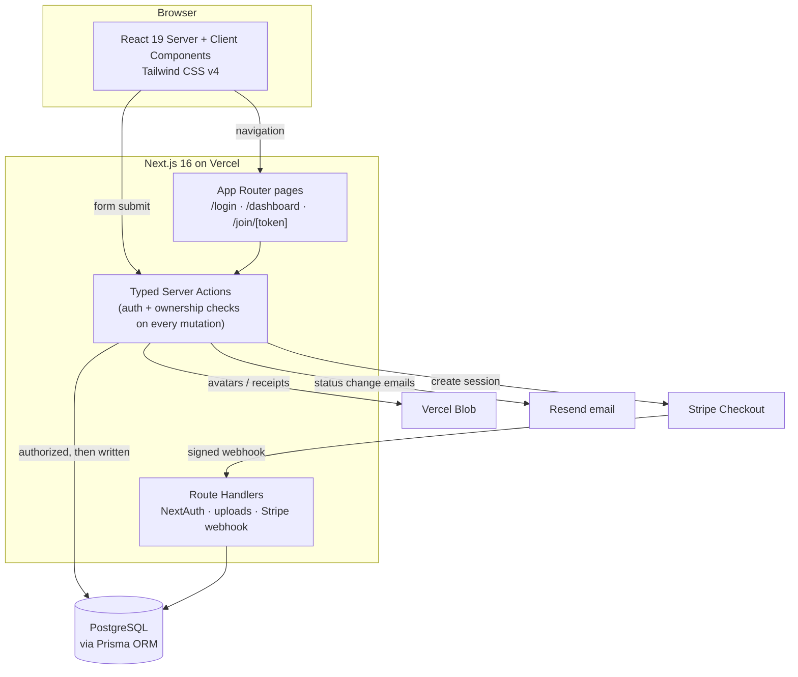

Every state change flows through a **typed server action** that re-checks authentication and trip ownership before touching the database. The client never holds privileged logic or determines amounts, status transitions, or access rights.

---

## User status machine

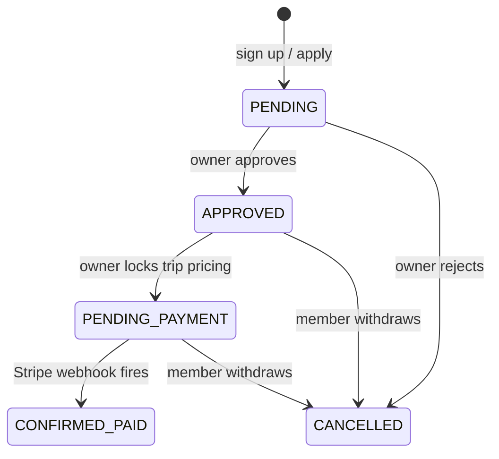

`lib/authz.ts` holds the whole member-side boundary — one place to read, one
place to change. Two rules it enforces, both of which this codebase got wrong
before they were consolidated:

- **Approval is read from the database, never from the session.** The NextAuth
  session is a JWT, so it is a snapshot from sign-in: a member removed from a
  trip kept a token still saying `APPROVED`. The token decides which nav links
  to render; it never decides a write.
- **Membership of *this* trip is checked, not membership in general.** Every
  action takes ids from the caller, so "is this caller approved?" is not enough
  — `user.tripId === thisTripId` is the check that matters.

The client-side affordances (hidden nav items, read-only components) are hints,
not the security boundary.

---

## Repository layout

```
.
├── app/
│   ├── actions/             # Server actions — one file per feature
│   │   ├── auth.ts          # Sign up, sign in
│   │   ├── trips.ts         # Create trip, invite, approve/reject
│   │   ├── meals.ts         # Phase control, voting, grocery list
│   │   ├── sleeping.ts      # Bed claims, bedmate requests
│   │   ├── itinerary.ts     # Comment CRUD
│   │   ├── contributions.ts
│   │   ├── expenses.ts
│   │   ├── payments.ts      # Stripe checkout session
│   │   ├── board.ts         # Group board + reactions
│   │   └── profile.ts
│   ├── api/
│   │   ├── auth/            # NextAuth route handler
│   │   ├── upload-avatar/   # Vercel Blob upload
│   │   ├── upload-lodging-photo/
│   │   └── webhooks/stripe/ # Payment confirmation, status update
│   ├── join/[token]/        # Public apply page
│   ├── login/ & signup/
│   └── dashboard/
│       ├── (member)/        # roster · itinerary · lodging · sleeping
│       │                    # meals · board · contributions · expenses
│       │                    # payment · preferences · profile
│       ├── my-trips/        # Owner: create, invite, approve, edit
│       └── intake/          # Guest form flow
├── components/              # DashboardNav · ItineraryView · MealsPlanner
│                            # RosterCard · ApprovalRequired · StatusBadge
├── components/forms/        # Field — label/control id wiring, done once
├── lib/                     # authz (the member-side boundary) · auth · db
│                            # approval · meals · pricing · reactions · sleep
│                            # trip · stripe · blob · resend
│                            # nav (dashboard routing map, unit-tested)
├── docs/
│   ├── ARCHITECTURE.md      # Data model, authorization, concurrency, trade-offs
│   └── screenshots/         # Generated by scripts/screenshots.ts
├── scripts/
│   └── screenshots.ts       # Captures the README images from the running app
├── tests/
│   ├── *.test.ts            # Vitest unit tests (pricing, authz, nav, …)
│   └── e2e/                 # Playwright: responsive · functional · accessibility
├── prisma/
│   ├── schema.prisma        # Full data model
│   ├── migrations/          # Versioned migration history
│   └── seed.ts              # Demo data for local development
└── types/                   # NextAuth + shared TypeScript declarations
```

---

## Key technical decisions

**Next.js App Router + server actions over a separate REST API.** Every mutation has session context and Postgres access. Co-locating the authorization check and the database write in one server action removes an entire layer of API surface area and makes the security posture auditable in a single pass: "does every server action authorize before it writes?"

**Prisma with committed migration history.** `prisma/migrations` is version-controlled and Vercel runs `prisma migrate deploy` on each build. CI applies migrations to a real Postgres database and fails on any drift between `schema.prisma` and the committed migrations — the two can never silently diverge.

**Single status enum over scattered boolean flags.** `PENDING / APPROVED / PENDING_PAYMENT / CONFIRMED_PAID / CANCELLED` in one column. `lib/authz.ts` is the single place to ask "can this user do X?" — easier to audit and harder to accidentally bypass than checking three booleans in different places.

**Server-side authorization first, UI affordances second.** Read-only mode for `PENDING` users hides the comment form client-side, but the `createItineraryComment` server action also rejects the call from any unapproved user. The visual hint and the security boundary are independent layers.

**Ownership checks on every owner action.** Trip-management mutations resolve the trip from its ID and assert `trip.ownerId === session.user.id` before touching any data. A member cannot act on a trip they don't own by crafting the request directly.

**A green build is not a working app.** The responsive suite proved its worth
on layout, then missed a real outage: server actions fail at call time, so a
page can render perfectly while its buttons are broken. Coverage now includes
invoking actions and asserting the write, because the failure mode that matters
is the one every other check is blind to.

**Responsive behaviour asserted in CI rather than eyeballed.** Layout
regressions are easy to ship and easy to miss: a change looks fine on the
window you happen to have open. Encoding "nothing overflows, nothing is too
small to tap" as executable assertions across five viewports turns a manual
pass that decays into a gate that holds. It found a container-width bug on its
first full run that a careful manual sweep had missed.

**Touch sizing keyed to pointer type, not viewport width.** The obvious
implementation — grow controls below the `sm` breakpoint — gets tablets wrong:
a 768px iPad is a touch device that would fall through to the compact desktop
sizes. Keying the 44px floor off `@media (pointer: coarse)` describes the actual
constraint (how precisely the user can point) rather than a proxy for it, and
correctly covers touch laptops and large tablets too.

**Amount derived server-side at Stripe checkout.** The server action reads the locked per-person cost from the database; the client never passes an amount. The signed Stripe webhook is the only thing that advances a user to `CONFIRMED_PAID`.

---

## Running locally

```bash
git clone https://github.com/taylordrew4u2/the-trip-handler.git
cd the-trip-handler
npm install
cp .env.example .env.local   # fill in values
npm run dev                  # http://localhost:3000
```

```bash
npm run db:seed     # seed a demo trip, roster, itinerary, and contributions
npm run build       # prisma generate + migrate deploy + next build
npm run test        # Vitest unit tests
npm run test:coverage # the same, with a threshold on the authorization logic
npm run test:e2e    # Playwright responsive suite (needs a build + seeded data)
npm run test:e2e:ui # the same suite in Playwright's interactive runner
npm run screenshots # regenerate the README images from the running app
npm run lint        # ESLint 9
npm run db:studio   # Prisma Studio
```

### Environment variables

Variable names (no values committed):

```
DATABASE_URL
NEXTAUTH_SECRET
NEXTAUTH_URL
ADMIN_EMAIL
STRIPE_SECRET_KEY
STRIPE_WEBHOOK_SECRET
RESEND_API_KEY
EMAIL_FROM
BLOB_READ_WRITE_TOKEN
NEXT_PUBLIC_APP_URL
```

---

## End-to-end walkthrough

Worth doing once with your browser narrowed to a phone width — the whole flow is
built to work there.

1. `/signup` — create an account. You land on the home screen (`/dashboard/start`).
2. `/dashboard/my-trips` — name your trip, get a private invite link and short join code.
3. Open the invite link in a second browser session, apply, and fill in the guest form.
4. Back as the owner, approve the applicant from `/dashboard/my-trips`.
5. As the approved member, claim a bed, vote on a meal, sign up for a contribution, comment on the itinerary.
6. Owner locks the three-line pricing. Member sees payment due on their dashboard.
7. Member completes Stripe Checkout from `/dashboard/payment`. The webhook marks them `CONFIRMED_PAID`.

Setting up and verifying that last step — the CLI forwarder, the two different
signing secrets, and how to prove the write landed rather than trusting a 200 —
is written up in [`docs/stripe-webhook.md`](docs/stripe-webhook.md).

---

## Testing

Four suites, split by what each can actually prove. All of them run in CI on
every pull request.

### Unit tests — `npm test`

**Vitest**, no browser, ~1s, 85 tests. These cover the logic where a mistake is
a correctness or security bug:

- **Pricing logic** — per-person cost calculation across housing, transport, and meals lines, including the deposit.
- **Approval guards** — `requireApprovedUser()` rejects `PENDING` and `CANCELLED` users for gated actions.
- **Trip ownership** — owner actions assert `trip.ownerId === session.user.id`; cross-owner mutations are rejected.
- **Authorization boundaries** — applying to a trip never silently reassigns a member already on another trip.
- **Member authorization boundaries** — `tests/member-authz.test.ts` drives the real actions and asserts that an unauthorized call writes *nothing*. A test that only checked the error message would still pass if the action returned an error after mutating.
- **The guards themselves** — `lib/authz.ts` and `lib/approval.ts` are covered directly, including the branches an action-level test can't reach: the legacy admin seat, a caller whose row has been deleted, a null trip id that must not become "matches everything". CI runs these with a coverage threshold, so deleting a suite fails the build rather than quietly reducing what's checked.
- **Navigation rules** — `lib/nav.ts` holds the dashboard's routing map: which destinations exist, which are gated behind approval, and which one counts as "current" for a URL. Keeping it out of the component means a nested route resolving to the wrong label, or a gated link leaking to a `PENDING` member, is caught without rendering anything.

### Responsive end-to-end tests — `npm run test:e2e`

**Playwright**, against a production build serving seeded data — because what
these assert (layout at a given width, computed control heights) only exists
once the real CSS is compiled and real content is on the page.

Every test runs at five viewports, declared as projects so a failure names the
device it broke on:

| Project | Width | Why it's in the matrix |
|---|---|---|
| `phone-320` | 320px | The narrowest screen still in real use — layouts break here first. |
| `phone-390` | 390px | The common modern phone. |
| `tablet-768` | 768px | A touch device that is *not* phone-width — the case a width-only breakpoint gets wrong. |
| `laptop-1280` | 1280px | Where the inline navigation does not fit and must collapse. |
| `desktop-1536` | 1536px | The breakpoint boundary where it turns back on. |

The phone and tablet projects use Playwright device descriptors rather than a
bare viewport size, because those set `hasTouch`/`isMobile` — which is what makes
`@media (pointer: coarse)` match. A plain viewport override would test the
desktop styles at a phone width and pass while the real thing was broken.

What they assert:

- **No horizontal overflow** — no element extends past the viewport, and the document does not scroll sideways. Elements that opt into their own `overflow-x: auto` are exempt, since a wide table in its own scroller is a deliberate choice.
- **Touch targets** — on touch projects, every button, link, select and input clears the touch-target floor. Inline links inside prose are exempt: they are part of a sentence, not a control.
- **Navigation** — every destination is reachable at every size; the wordmark is never squeezed to nothing; and the collapsed menu names the current page, closes on navigation, on the back button, and on `Escape`, and locks the page behind it while open.

Each of those assertions exists because that exact thing broke at least once
during development. The back-button test, for instance, guards a menu that
closed on link clicks but stayed open over the previous page when you went back.

### Functional end-to-end tests — same command

Layout tests have a specific blind spot, and this project hit it. A `"use
server"` module may only export async functions; Next rejects such a module when
an **action is invoked**, not at build or render time. So a bad export left the
board page returning 200 with every layout assertion passing, while posting and
reacting failed with a 500. `next build` exited 0 the whole time.

`tests/e2e/flows.spec.ts` therefore invokes real actions and asserts the write
landed: a member posts to the board and sees it appear, adds and removes a
reaction, and no request 5xxs while doing it. These mutate data, so they run on
one viewport rather than all five, and each undoes what it does.

### Accessibility tests — same command

`tests/e2e/a11y.spec.ts` runs axe-core against every page behind and in front of
auth, at WCAG 2.1 A/AA, and fails on any violation. It is layout-independent, so
it runs on one project rather than five. See
[Accessible, and checked on every commit](#accessible-and-checked-on-every-commit)
for what it found and what it does not cover.

**A named limitation:** the suite runs on Chromium only, to keep CI to a single
browser download. What is under test is this app's layout and media queries
rather than rendering-engine differences — but it does mean a Safari-specific
bug would not be caught here, so Safari stays a manual check.

---

## Security

- Secrets are not committed; `.env.example` documents required variable names only.
- **Every one of the 81 exported server actions authenticates before mutating.** The single exception is `signupAction`, which is the public account-creation entry point. User and trip IDs come from the session, never from client-supplied arguments.
- **Approval is read from the database on every request, not from the session token.** The session is a JWT and therefore a snapshot from sign-in; a member removed from a trip used to keep acting on it until their token expired. `lib/authz.ts` re-reads the row, so a revoked approval takes effect on the next request. The token's status is used only to decide which links to render.
- **Trip-scoped data is filtered by `tripId` on the server, and the filter is the caller's own trip.** Every action takes ids from the caller, so checking "is this caller approved?" is not sufficient — the check is `user.tripId === thisTripId`. Auditing this turned up two live gaps, both fixed: an approved member of one trip could claim beds on another, and the group board had no trip column at all, putting every trip's posts in one shared stream. Both now carry regression tests that fail against the old code.
- Anything exported from a `"use server"` module is a callable endpoint, including helpers only ever invoked during page render. The idempotent setup helpers (`ensureMealPlanSetup`, `ensureSleepingSetup`) therefore carry the same membership checks as the rest — being "internal" is not a boundary.
- Authorization is layered: page (server component returns gated content) → action (`lib/authz.ts` guard or ownership check) → resource (users can only edit their own comments). Each layer is independent; the UI hint is not the boundary.
- Claiming a bed counts occupants and inserts inside one serializable transaction, so two members racing for the last slot cannot both win. The unique constraint alone does not cover it — it stops one person being in two beds, not two people overfilling one.
- Stripe Checkout amount is derived server-side from locked pricing; the action takes no amount argument. The webhook validates its signature before trusting the payload, and it is the only thing that can advance a user to `CONFIRMED_PAID` — the `success_url` redirect is cosmetic.
- Passwords are hashed with bcrypt (cost factor 10).
- File uploads authenticate the session and validate content type and size before forwarding to Vercel Blob.

See [`SECURITY.md`](./SECURITY.md) for the vulnerability reporting process, and
[`docs/ARCHITECTURE.md`](docs/ARCHITECTURE.md) for how the authorization model
fits together.

---

## What I built

- Designed the full data model: the user status machine, multi-tenant trip ownership with invite tokens, the three-line cost model, itinerary comments, bed assignments with bedmate-request rules, the four-phase meal poll, and the contribution and expense ledgers.
- Built every page in the App Router, mixing React 19 server components with targeted client components only where interactivity is required.
- Implemented every mutation as a typed server action with explicit auth, ownership, and status checks — no REST endpoints — keeping the trust boundary inside one file per feature.
- Built multi-tenant, invite-only trips: any member becomes an owner, gets a private invite link and join code, and manages applicants and trip details scoped entirely to trips they created.
- Implemented the approval-gated UI (read-only mode for `PENDING` users) as a complement to — not a replacement for — server-side authorization.
- Integrated Stripe Checkout end-to-end: server action creates the session, signed webhook records payment, status update gates the rest of the app.
- Integrated Vercel Blob for file uploads and Resend for transactional emails covering all key status transitions.
- Made the whole app responsive from 320px up, including a nav that collapses
  from thirteen inline tabs to a grouped menu sheet, pointer-based touch target
  sizing, and native mobile keyboard and autofill hints on every form.
- Built a Playwright suite that proves it: both user journeys driven through a
  real browser at five viewports against seeded data, asserting no horizontal
  overflow, touch-target minimums, and collapsed-menu behaviour — wired into CI
  so a layout regression fails the build instead of reaching a phone.
- Consolidated the member-side authorization boundary into `lib/authz.ts` after an audit found two live cross-trip gaps — beds claimable across trips, and a group board with no trip column — and made every guard read approval from the database rather than the sign-in-time JWT.
- Added an axe-core suite covering every page at WCAG 2.1 AA, and fixed what it found: unlabelled controls across four forms, and contrast below 4.5:1 on the app's muted text.
- Built `MealsPlanner` — a phase-aware React component handling suggestions, voting bars, helper sign-ups, and grocery list generation — and `ItineraryView` with per-item threaded comment sections.

---

## License

MIT — see [`LICENSE`](./LICENSE).
