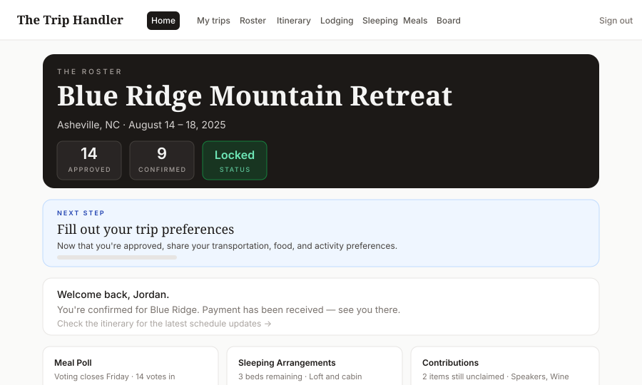
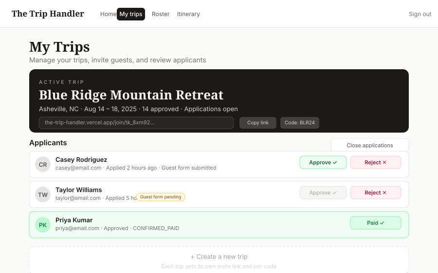
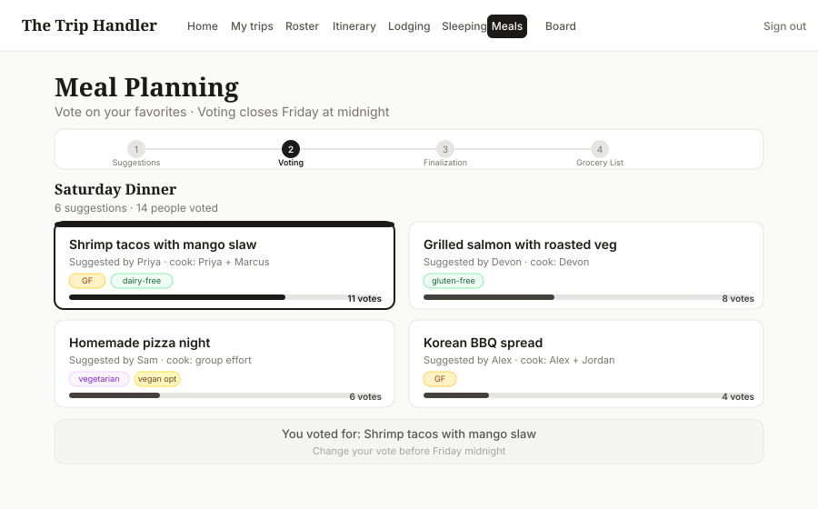
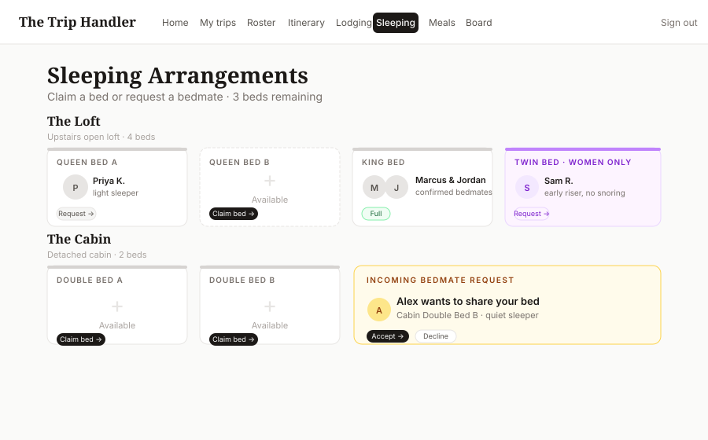
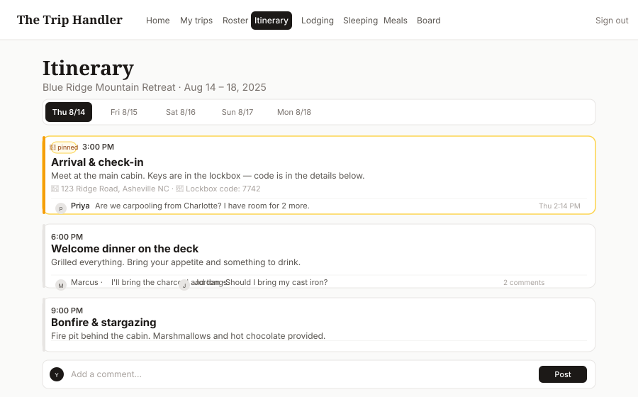
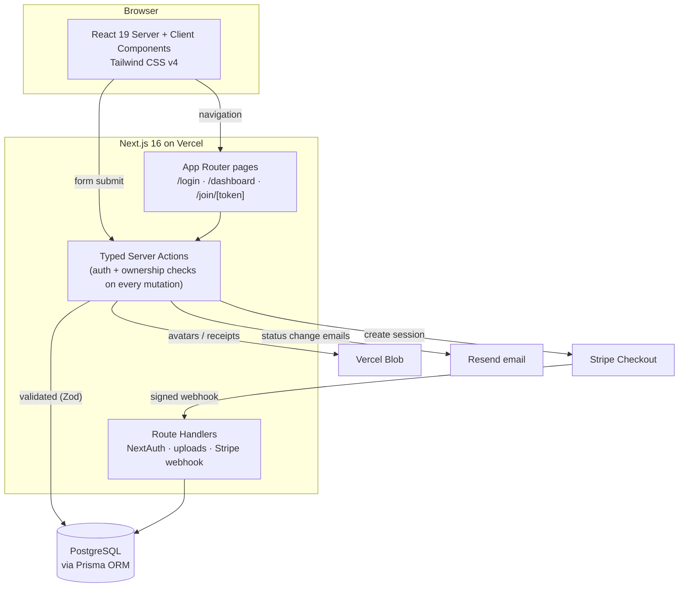
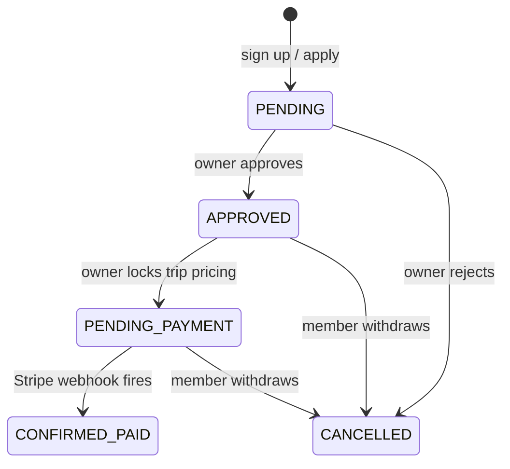

# The Trip Handler

[](https://github.com/taylordrew4u2/the-trip-handler/actions/workflows/ci.yml)
[](https://www.typescriptlang.org/)
[](https://nextjs.org/)
[](https://the-trip-handler.vercel.app)

**The Trip Handler** is a full-stack trip coordination app for multi-day group trips. Instead of juggling group chats, spreadsheets, and Venmo requests, one person creates a trip, shares a private invite link, approves who comes, and the entire group gets a single dashboard to handle lodging, meals, beds, the itinerary, contributions, expenses, and Stripe-collected payments.

**Live demo → [the-trip-handler.vercel.app](https://the-trip-handler.vercel.app)**

---

## Screenshots

| Member dashboard | Owner trip management |
|---|---|
|  |  |

| Meal poll with phase-aware voting | Sleeping arrangements with bed-claim and bedmate requests |
|---|---|
|  |  |

| Itinerary with per-item comment threads |
|---|
|  |

---

## What it does

The Trip Handler is invite-only by design. There is no public trip directory — you only get in with a private link or a short join code from the organizer.

**As a trip owner:**
- Create a trip and get a private invite link + shareable join code instantly
- Open and close applications on your schedule
- Review applicants alongside their submitted guest forms, then approve or reject
- Edit trip details, lodging info, itinerary, and meal slots
- Lock the three-line pricing (housing, transport, meals) when numbers are final

**As an invited member:**
- Apply through the invite link; fill out a detailed guest form covering transportation, sleeping preferences, dietary needs, and more
- Once approved, claim a bed, vote on meals, sign up for contributions, comment on the itinerary, submit expenses, and post to the group board
- Pay your per-person share through Stripe Checkout; the app tracks your confirmed-paid status automatically

**Access is gated by status.** A `PENDING` member can read the itinerary and lodging but cannot comment, vote, or claim beds. An `APPROVED` member unlocks the full dashboard. `CONFIRMED_PAID` is the terminal state after Stripe confirms payment.

---

## Features

### Trip creation and invitations
Any signed-in member can create a trip and becomes its owner. The app generates a unique private invite link (`/join/[token]`) and a short verbal join code. Owners can open and close applications at any time, and only ever see and manage trips they created.

### Application and approval flow
Applicants open the invite link (signing up if needed) and fill out a detailed guest form with intake questions covering emergency contacts, van transportation preferences, sleeping tags, dietary restrictions, medical notes, activity interests, and content-creation comfort. The owner reviews submitted forms and approves or rejects applicants. Resend sends a transactional email on each status change.

### Bed assignment and bedmate requests
Owners configure a bed inventory with room names, bed types, and optional restrictions (e.g., women-only). Members claim available beds directly or send bedmate requests to someone already in a bed. The recipient accepts or declines. The UI shows sleep tags and notes from each member's profile to help with matching.

### Meal poll — phased, multi-slot planning
Meal planning runs through four phases: suggestions, voting, admin finalization, and grocery list. Members propose meals for each slot with dietary tags and which cooking role they'll fill (cook, prep, shop, clean). Votes are tallied with a visual bar. After the owner finalizes winners, the app generates a categorized grocery list with purchase-tracking checkboxes.

### Itinerary with threaded comments
A day-by-day schedule with times, locations, and notes. Owners can pin important items. Each itinerary entry has its own comment thread — `PENDING` users can read but not post; `APPROVED` users get full read/write access.

### Group board with emoji reactions
A free-form comment board for the whole group, gated to approved members. Supports emoji reactions (👍 ❤️ 😂 🔥 💯 🎭) on any post.

### Contributions and expenses
Members sign up for contribution items (what to bring) and submit shared expenses with receipt uploads to Vercel Blob. Running totals are visible on the expenses page.

### Stripe checkout and payment tracking
Per-person pricing is derived server-side from the owner's locked three-line cost model plus a refundable deposit. Members pay via Stripe Checkout. A signed webhook records payment and flips status to `CONFIRMED_PAID` — the client never controls the amount or the status transition.

### Transactional email via Resend
Approval, rejection, cancellation, form-unlocked, bed-bump, and trip-locked emails are sent automatically on each state transition.

---

## Designed for phones and desktops

Most of this app gets used on a phone — someone claims a bed from the couch, votes
on dinner from a queue, checks the itinerary from a car. The desktop layout is
where an organizer sits down to approve applicants and set pricing. Both are
first-class, and every screen is built to work at 320px and at 1536px.

**Navigation adapts to the space it has.** The member area has thirteen
destinations. On a wide screen they sit inline as a single row of tabs. Below
that, the header collapses to the name of the page you're on plus one control
that opens a grouped menu — *Trip*, *The group*, *You* — so the whole app is one
tap away instead of hidden behind a sideways scroll. The menu closes on
navigation (including the back button), closes on `Escape`, dims the page behind
it, and locks background scrolling while open.

**Touch targets are sized by pointer, not by width.** An iPad is 768px wide and
still operated with a thumb, so a breakpoint is the wrong thing to key off.
`app/globals.css` applies the 44px minimum from Apple's HIG and WCAG 2.5.5 under
`@media (pointer: coarse)`, which leaves the compact look intact on machines with
a mouse.

**Forms behave like native ones.** Inputs carry `autocomplete`, `inputmode`, and
`enterkeyhint` so password managers fill them and the on-screen keyboard shows
the right layout and return key. Every control is at least 16px on touch devices,
which is what stops iOS Safari from zooming the page in when a field is focused.

**Layout details that matter on a small screen.** Rows that pair a label with
controls stack rather than squeeze; long trip names, emails, and join codes wrap
instead of pushing the page sideways; the viewport is declared `viewport-fit=cover`
with matching `theme-color` so an installed home-screen app paints to the edges;
and `*-safe` utilities keep content clear of the notch and home indicator.
Motion respects `prefers-reduced-motion`, and a visible focus ring is restored
globally for keyboard users.

**Verified, not assumed.** Both journeys — organizer and member — were driven
through a real browser at 320, 390, 768, 1024, 1280, and 1536px against a seeded
database, asserting on every page that nothing overflows horizontally, that no
control falls below the touch minimum, and that the mobile menu opens and closes.

---

## Tech stack

| Layer | Choice |
|---|---|
| Language | TypeScript (strict) |
| Framework | Next.js 16 — App Router, React 19 server + client components, server actions |
| Styling | Tailwind CSS v4 — mobile-first, responsive to 320px · Fraunces (serif) + Inter (sans) |
| Database | PostgreSQL via Vercel Postgres |
| ORM | Prisma v5 — versioned migration history committed under `prisma/migrations` |
| Auth | NextAuth.js v4 — credentials provider, JWT sessions, bcrypt (cost 10) |
| Payments | Stripe Checkout + signed webhook |
| File storage | Vercel Blob — avatars, lodging photos, expense receipts |
| Email | Resend |
| Validation | Zod |
| Testing | Vitest |
| Hosting | Vercel |

---

## Architecture



Every state change flows through a **typed server action** that re-checks authentication and trip ownership before touching the database. The client never holds privileged logic or determines amounts, status transitions, or access rights.

---

## User status machine



`lib/approval.ts` centralizes the `requireApprovedUser()` predicate. All server actions call it before executing gated mutations — the client-side affordances (hidden nav items, read-only components) are hints, not the security boundary.

---

## Repository layout

```
.
├── app/
│   ├── actions/             # Server actions — one file per feature
│   │   ├── auth.ts          # Sign up, sign in
│   │   ├── trips.ts         # Create trip, invite, approve/reject
│   │   ├── meals.ts         # Phase control, voting, grocery list
│   │   ├── sleeping.ts      # Bed claims, bedmate requests
│   │   ├── itinerary.ts     # Comment CRUD
│   │   ├── contributions.ts
│   │   ├── expenses.ts
│   │   ├── payments.ts      # Stripe checkout session
│   │   ├── board.ts         # Group board + reactions
│   │   └── profile.ts
│   ├── api/
│   │   ├── auth/            # NextAuth route handler
│   │   ├── upload-avatar/   # Vercel Blob upload
│   │   ├── upload-lodging-photo/
│   │   └── webhooks/stripe/ # Payment confirmation, status update
│   ├── join/[token]/        # Public apply page
│   ├── login/ & signup/
│   └── dashboard/
│       ├── (member)/        # roster · itinerary · lodging · sleeping
│       │                    # meals · board · contributions · expenses
│       │                    # payment · preferences · profile
│       ├── my-trips/        # Owner: create, invite, approve, edit
│       └── intake/          # Guest form flow
├── components/              # DashboardNav · ItineraryView · MealsPlanner
│                            # RosterCard · ApprovalRequired · StatusBadge
├── lib/                     # auth · db · approval · meals · pricing
│                            # sleep · trip · stripe · blob · resend
├── prisma/
│   ├── schema.prisma        # Full data model
│   ├── migrations/          # Versioned migration history
│   └── seed.ts              # Demo data for local development
└── types/                   # NextAuth + shared TypeScript declarations
```

---

## Key technical decisions

**Next.js App Router + server actions over a separate REST API.** Every mutation has session context and Postgres access. Co-locating the auth check, Zod validation, and database write in one server action removes an entire layer of API surface area and makes the security posture auditable in a single pass: "does every server action call `getServerSession`?"

**Prisma with committed migration history.** `prisma/migrations` is version-controlled and Vercel runs `prisma migrate deploy` on each build. CI applies migrations to a real Postgres database and fails on any drift between `schema.prisma` and the committed migrations — the two can never silently diverge.

**Single status enum over scattered boolean flags.** `PENDING / APPROVED / PENDING_PAYMENT / CONFIRMED_PAID / CANCELLED` in one column. `lib/approval.ts` is the single place to ask "can this user do X?" — easier to audit and harder to accidentally bypass than checking three booleans in different places.

**Server-side authorization first, UI affordances second.** Read-only mode for `PENDING` users hides the comment form client-side, but the `createItineraryComment` server action also rejects the call from any unapproved user. The visual hint and the security boundary are independent layers.

**Ownership checks on every owner action.** Trip-management mutations resolve the trip from its ID and assert `trip.ownerId === session.user.id` before touching any data. A member cannot act on a trip they don't own by crafting the request directly.

**Touch sizing keyed to pointer type, not viewport width.** The obvious
implementation — grow controls below the `sm` breakpoint — gets tablets wrong:
a 768px iPad is a touch device that would fall through to the compact desktop
sizes. Keying the 44px floor off `@media (pointer: coarse)` describes the actual
constraint (how precisely the user can point) rather than a proxy for it, and
correctly covers touch laptops and large tablets too.

**Amount derived server-side at Stripe checkout.** The server action reads the locked per-person cost from the database; the client never passes an amount. The signed Stripe webhook is the only thing that advances a user to `CONFIRMED_PAID`.

---

## Running locally

```bash
git clone https://github.com/taylordrew4u2/the-trip-handler.git
cd the-trip-handler
npm install
cp .env.example .env.local   # fill in values
npm run dev                  # http://localhost:3000
```

```bash
npm run db:seed    # seed a demo trip, roster, itinerary, and contributions
npm run build      # prisma generate + migrate deploy + next build
npm run test       # Vitest unit tests
npm run lint       # ESLint 9
npm run db:studio  # Prisma Studio
```

### Environment variables

Variable names (no values committed):

```
DATABASE_URL
NEXTAUTH_SECRET
NEXTAUTH_URL
ADMIN_EMAIL
STRIPE_SECRET_KEY
STRIPE_PUBLISHABLE_KEY
STRIPE_WEBHOOK_SECRET
RESEND_API_KEY
EMAIL_FROM
BLOB_READ_WRITE_TOKEN
NEXT_PUBLIC_STRIPE_PUBLISHABLE_KEY
NEXT_PUBLIC_APP_URL
```

---

## End-to-end walkthrough

Worth doing once with your browser narrowed to a phone width — the whole flow is
built to work there.

1. `/signup` — create an account. You land on the home screen (`/dashboard/start`).
2. `/dashboard/my-trips` — name your trip, get a private invite link and short join code.
3. Open the invite link in a second browser session, apply, and fill in the guest form.
4. Back as the owner, approve the applicant from `/dashboard/my-trips`.
5. As the approved member, claim a bed, vote on a meal, sign up for a contribution, comment on the itinerary.
6. Owner locks the three-line pricing. Member sees payment due on their dashboard.
7. Member completes Stripe Checkout from `/dashboard/payment`. The webhook marks them `CONFIRMED_PAID`.

---

## Testing

Unit tests run with **Vitest** (`npm test`) and execute in CI on every PR. Coverage includes:

- **Pricing logic** — per-person cost calculation across housing, transport, and meals lines, including the deposit.
- **Approval guards** — `requireApprovedUser()` rejects `PENDING` and `CANCELLED` users for gated actions.
- **Trip ownership** — owner actions assert `trip.ownerId === session.user.id`; cross-owner mutations are rejected.
- **Authorization boundaries** — applying to a trip never silently reassigns a member already on another trip.

---

## Security

- Secrets are not committed; `.env.example` documents required variable names only.
- All server actions call `getServerSession(authOptions)` before any mutation. User and trip IDs come from the session, never from client-supplied arguments.
- Authorization is layered: page (server component returns gated content) → action (`requireApprovedUser` / ownership check) → resource (users can only edit their own comments).
- Trip-scoped data is filtered by `tripId` on the server; members cannot read or write to trips they aren't on.
- Stripe Checkout amount is derived server-side from locked pricing. The webhook validates its signature before trusting the payload.
- Passwords are hashed with bcrypt (cost factor 10).
- File uploads authenticate the session and validate content type and size before forwarding to Vercel Blob.

See [`SECURITY.md`](./SECURITY.md) for the vulnerability reporting process.

---

## What I built

- Designed the full data model: the user status machine, multi-tenant trip ownership with invite tokens, the three-line cost model, itinerary comments, bed assignments with bedmate-request rules, the four-phase meal poll, and the contribution and expense ledgers.
- Built every page in the App Router, mixing React 19 server components with targeted client components only where interactivity is required.
- Implemented every mutation as a typed server action with explicit auth, ownership, and status checks — no REST endpoints — keeping the trust boundary inside one file per feature.
- Built multi-tenant, invite-only trips: any member becomes an owner, gets a private invite link and join code, and manages applicants and trip details scoped entirely to trips they created.
- Implemented the approval-gated UI (read-only mode for `PENDING` users) as a complement to — not a replacement for — server-side authorization.
- Integrated Stripe Checkout end-to-end: server action creates the session, signed webhook records payment, status update gates the rest of the app.
- Integrated Vercel Blob for file uploads and Resend for transactional emails covering all key status transitions.
- Made the whole app responsive from 320px up, including a nav that collapses
  from thirteen inline tabs to a grouped menu sheet, pointer-based touch target
  sizing, and native mobile keyboard and autofill hints on every form.
- Built `MealsPlanner` — a phase-aware React component handling suggestions, voting bars, helper sign-ups, and grocery list generation — and `ItineraryView` with per-item threaded comment sections.

---

## License

MIT — see [`LICENSE`](./LICENSE).
